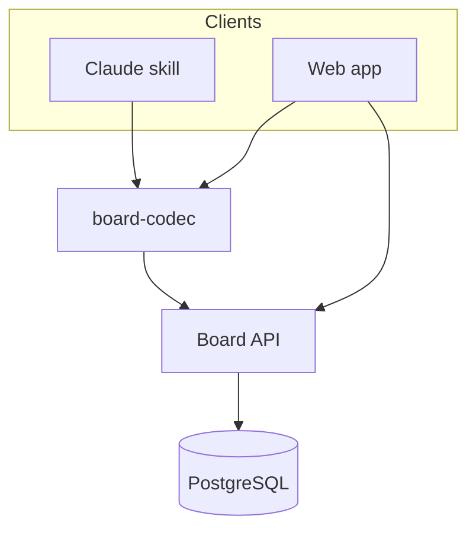

# Exec Board

A persistent, three-layer task board (project → task → subtask) driven from ordinary conversation with a Claude skill, backed by a Next.js web app and PostgreSQL.


<!-- TODO: add a demo.gif or screenshot of the board view under docs/ and link it here -->

## Features
- Single API backs two clients — a Claude skill (in-chat) and a Next.js web app — so a plan stated in chat and its status changes stay in sync automatically
- Three-layer node tree (project/phase → task → subtask) with a server-derived "next action," never stored client-side
- Append-only event log (`Event`) is the source of truth; every mutation is reversible via compensating revert, not deletion
- Postgres row-level security, keyed per-transaction, isolates each user's boards at the database layer
- Lossless markdown import/export (`board-codec`) so a board is portable as a single `.md` file
- One personal-access-token per user, argon2-hashed, bearer auth on every route but `/api/health`

## Quick Start
```bash
git clone git@github.com:JaxzTan/todo_list.git
cd todo_list
npm install

# create .env with the variables listed under Configuration below

npm run db:up                          # start Postgres via Docker Compose
npm run db:migrate && npm run db:generate
bash scripts/setup-db-role.sh          # sync the RLS-scoped app role's password from .env
node --env-file=.env scripts/issue-token.mts <handle>   # prints a PAT once — save it

npm run dev
```
Open http://localhost:3300

Alternatively, run the full stack (app + Postgres) via Docker Compose:
```bash
make up      # build + start, prints the web URL
make logs    # follow logs
make down    # stop and remove containers
```

## Requirements
Node.js 24, Docker + Docker Compose (for local Postgres), `ngrok` (only to expose the app to the Claude skill sandbox)

## Configuration
| Var | Default | Description |
|---|---|---|
| `DATABASE_URL` | — | Postgres connection string, superuser role (migrations, Prisma Studio) |
| `APP_DATABASE_URL` | — | Postgres connection string, RLS-scoped `exec_board_app` role (app runtime) |
| `DB_USER` / `DB_PASSWORD` / `DB_NAME` / `DB_PORT` / `DB_HOST` | — | Local Postgres container credentials/connection, used by `docker-compose.yml` |
| `APP_DB_PASSWORD` | — | Password synced into the `exec_board_app` role by `scripts/setup-db-role.sh` |
| `NGROK` | — | ngrok auth token, used by `scripts/start-tunnel.sh` |
| `PAT_<HANDLE>` (e.g. `PAT_JAXZ`) | — | Issued personal access token per user, read by client scripts |
| `EXEC_BOARD_BASE_URL` | — | Base URL the skill client calls; falls back to local file mode if unreachable |
| `EXEC_BOARD_TOKEN` | — | Bearer token the skill client sends as `Authorization: Bearer <token>` |
| `EXEC_BOARD_LOCAL_DIR` | `.exec-board/` | Local fallback directory the skill client writes to when the API is unreachable |

## Usage
Every route but `GET /api/health` requires a bearer token issued by `scripts/issue-token.mts`:
```bash
curl http://localhost:3300/api/boards/my-project \
  -H "Authorization: Bearer $EXEC_BOARD_TOKEN"
```
```json
{"board":{"slug":"my-project","title":"..."},"nodes":[...],"nextAction":{"nodeId":"...","number":"1.2","text":"..."},"counts":{"done":3,"total":9}}
```
Full endpoint reference: `docs/endpoint.md`.

## Architecture
Two clients — a Claude skill and a Next.js web app — operate on one board format through a shared `board-codec` package, backed by a single PostgreSQL database behind a Next.js API. See `architecture.md` for the full system design (data model, tenancy, security model, testing strategy) and `docs/3 Layers Rule PRD (1).md` / `docs/3 Layers Rule PRD (3).md` for the PRD/TRD.



## Development
```bash
npm run dev         # Next.js dev server, http://localhost:3300
npm test             # Vitest (root + workspace packages)
npm run e2e          # Playwright end-to-end tests
npm run lint          # ESLint
npm run typecheck     # tsc --noEmit
```
CI (`.github/workflows/ci.yml`) runs typecheck+lint, unit tests, Playwright e2e, and a Prisma migration drift check on every PR and push to `main`.

## Contributing
Personal project, not currently accepting external contributions. <!-- TODO: add CONTRIBUTING.md if that changes -->

## License
Dual-licensed under either [MIT](LICENSE-MIT) or [Apache License, Version 2.0](LICENSE-APACHE), at your option.
