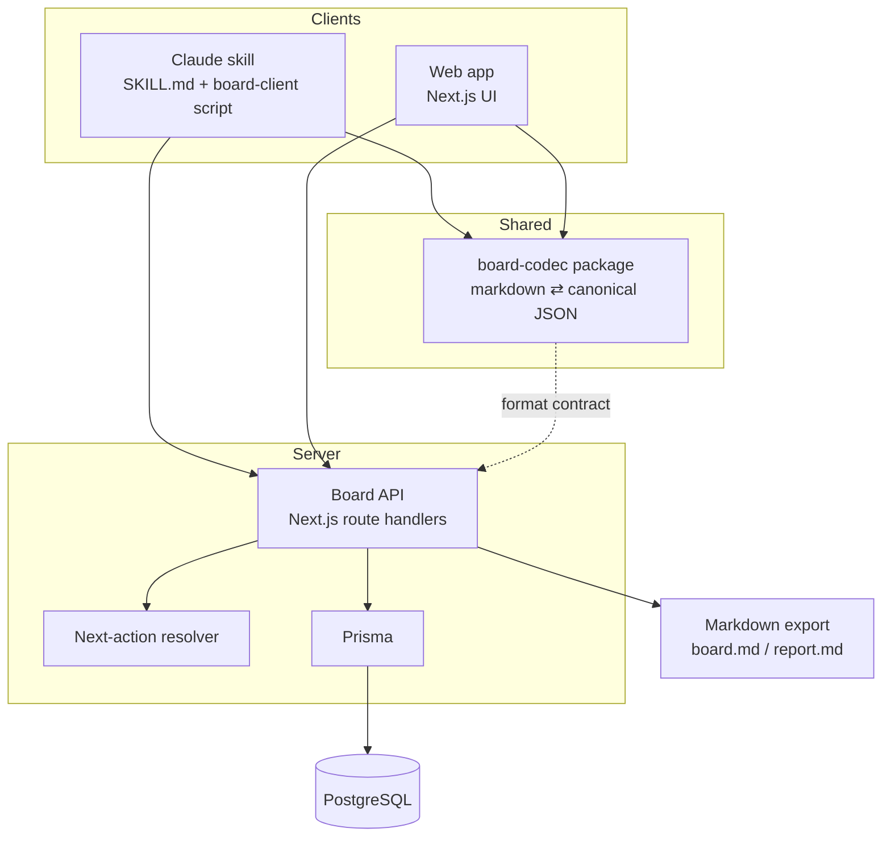

# Architecture: Exec Board

This document summarizes the system architecture from `docs/3 Layers Rule PRD (3).md` (TRD) and `docs/3 Layers Rule PRD (1).md` (PRD). See those files for full rationale; this is the load-bearing summary.

## System overview

Exec Board is a persistent task board for multi-step, multi-session work, tracked in three layers (project → task → subtask). Two clients — a Claude skill (in-chat) and a standalone Next.js web app — operate on one board format, backed by a single PostgreSQL database shared through a codec package.

| Component | Responsibility |
|---|---|
| `board-codec` (`packages/board-codec`) | Sole owner of the markdown grammar; parses markdown to canonical JSON and serializes back. Both clients and the API depend on it. |
| Board API (`app/api/**/route.ts`) | CRUD over boards and nodes; every mutation emits an event in the same transaction. |
| Next-action resolver | Derives `Next action` server-side from status, phase, priority, due date, and owner. Never stored. |
| Claude skill client (`scripts/board-client.mts`) | Thin script the skill calls to fetch, patch, and export a board. Falls back to local file mode (`.exec-board/`) when the API is unreachable. |
| Web app (`app/`) | Board view, status editing, report download. Read/write against the same API. |
| PostgreSQL | Canonical state. |

Deployment is monolith-first, single-environment: Next.js as the full-stack framework, Postgres running locally via Docker Compose, exposed to the skill sandbox through an ngrok tunnel. There is no queue, no cache, and no separate prod environment — the dev machine is the deployment.

## Tech stack

| Layer | Choice | Why |
|---|---|---|
| Full stack | Next.js (App Router) | One framework, one deployable; doesn't justify a split frontend/backend at this scale |
| Styling | TailwindCSS | Board view is mostly tables and status pills |
| Shared format | `board-codec` (TypeScript workspace package) | One grammar owner prevents skill/app drift |
| Database | PostgreSQL (local) + Prisma | Relational fits steps/notes/blockers cleanly; local keeps board content off third-party infra |
| DB runtime | Docker Compose, named volume | Reproducible, disposable, no host Postgres install |
| Auth | One personal access token (PAT) per user, bearer | Two users, no signup flow needed |
| Isolation | Postgres row-level security (RLS), tenant set per transaction | Query-level `WHERE ownerId = ?` scoping will eventually be forgotten once |
| Exposure | ngrok tunnel to `localhost:3000` | Zero-infra way to reach a local app from the skill sandbox |
| Export | Markdown files written to disk on demand | Matches skill behaviour and the portability goal |

## Data model

Five facts drive the schema shape (`prisma/schema.prisma`):

| # | Fact | Consequence |
|---|---|---|
| A1 | A board is a history, not a snapshot | An `Event` log is the source of truth |
| A2 | Every write is an inference (no command vocabulary) | Writes carry provenance (`Event.source`, `ambiguous`) and must be reversible (`revertedBy`) |
| A3 | Project, phase, task, and subtask are one tree at different depths | One `Node` table, not three grouping mechanisms |
| A4 | Next action, step numbers, and counts are functions of state | Not stored |
| A5 | The markdown file is a projection; import is lossy | Unparsed remnants belong to the `Import`, not the board |

Core models: `User`, `Board`, `Node` (self-referential tree, `kind: GROUP | STEP`), `Event` (append-only log, JSON payload discriminated by `type`), `Blocker`, `Session`, `Import`, `Report`.

The one deliberate denormalization: `Node.status` is a materialized fold over `STATUS_CHANGED` events. It's stored because every read path needs it, but it is only ever written inside the same transaction as the event that justifies it — a repair job (`POST /api/boards/:slug/rebuild`) can rebuild it from the log, which is what keeps it a cache rather than a second truth.

### Tenancy

`User.id` and `Board.ownerId` are the only tenancy structures; child rows (`Node`, `Event`, `Blocker`, `Session`, `Import`, `Report`) carry no `ownerId` and inherit tenancy through `boardId`. Consequences:

- `slug` is `@@unique([ownerId, slug])`, never globally unique — global uniqueness would let one user's board name block or leak the existence of another's.
- Every child-row access goes through its board (`where: { id, board: { ownerId } }`) or through RLS — never `findUnique` by bare id.
- Cross-tenant access returns `404`, never `403` (a `403` would confirm the board exists).

## API surface

Full reference: `docs/endpoint.md`. Summary:

| Method | Path | Purpose |
|---|---|---|
| GET | `/api/health` | Unauthenticated liveness probe; skill client uses it to pick API vs. local-file mode |
| GET / POST | `/api/boards` | List / create boards |
| GET | `/api/boards/:slug` | Board detail + derived next action + counts |
| GET | `/api/boards/:slug/markdown` | Lossless markdown export |
| POST | `/api/boards/import` | Import markdown (create or full-replace) |
| POST | `/api/boards/:slug/nodes` | Add a node (project/phase `GROUP` or task/subtask `STEP`) |
| PATCH | `/api/boards/:slug/nodes/:nodeId` | Status/title/due/prio/owner/archive changes, each emitting its own event |
| POST | `/api/boards/:slug/nodes/:nodeId/notes` | Append a note |
| GET | `/api/boards/:slug/events` | Event log |
| POST | `/api/boards/:slug/events/:id/revert` | Compensating revert (nothing is deleted) |
| POST | `/api/boards/:slug/sessions` | Open/close a session |
| GET | `/api/boards/:slug/report` | Generate a session report |
| POST | `/api/boards/:slug/rebuild` | Replay the event log and repair drifted `Node.status` |

Every mutation returns the recomputed `nextAction` and `counts` so neither client derives them locally.

## Security model

Three layers of defence, since the threat model includes both an outsider reaching the API and one user reading the other's boards:

1. **Tunnel edge** — ngrok auth in front of the exposed port; the tunnel only runs during active sessions.
2. **Application** — one PAT per user (`Authorization: Bearer`), stored as an argon2 hash (`@node-rs/argon2`); a shared token silently collapses tenants into one.
3. **Database** — Postgres RLS, keyed on a `SET LOCAL app.current_user_id` session variable per transaction, enforced through a Prisma client extension since Prisma has no native hook for per-transaction session variables.

Accepted risk: ngrok terminates TLS at its edge, so board content transits third-party infrastructure in plaintext at that hop — acceptable for a personal tool, revisited if boards ever hold non-personal material. The host machine's owner can always read the database directly via `psql`; RLS constrains the application, not the host.

## Testing strategy

- Round-trip property tests on `board-codec` (generate → serialize → parse → assert equality), substituting for a format validator that was deliberately not built.
- Golden-file tests over a corpus of real (including hand-mangled) boards, asserting graceful degradation on the mangled ones.
- Table-driven service tests for the invariants both clients must not diverge on (single `doing`, blocker required on `stuck`, parent auto-completion, scope-change logging).
- Fold-rebuild test: drop `Node.status`, replay the event log, assert the rebuild matches — keeps the denormalization honest.
- Cross-tenant tests generated over the route table: user B requesting user A's board by id or slug must get `404`.
- Playwright e2e (`e2e/`) for the web app; manual verification for the skill's auto-capture (prompt behaviour, not deterministically testable).

## Known gaps / open items

- `Board.parallelAllowed` (the "two `doing`" escape hatch) exists in the schema pending a decision to drop it — see TRD §6.
- No offsite backup is wired up yet beyond `scripts/backup-db.sh`; TRD recommends a daily `pg_dump` to a synced location, retained 14 days.
- ngrok's free-tier hostname rotates on restart; TRD recommends a reserved domain or a resolver indirection before relying on `TR-12`'s local fallback long-term.
