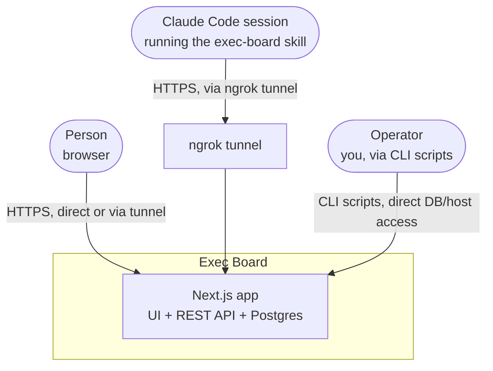
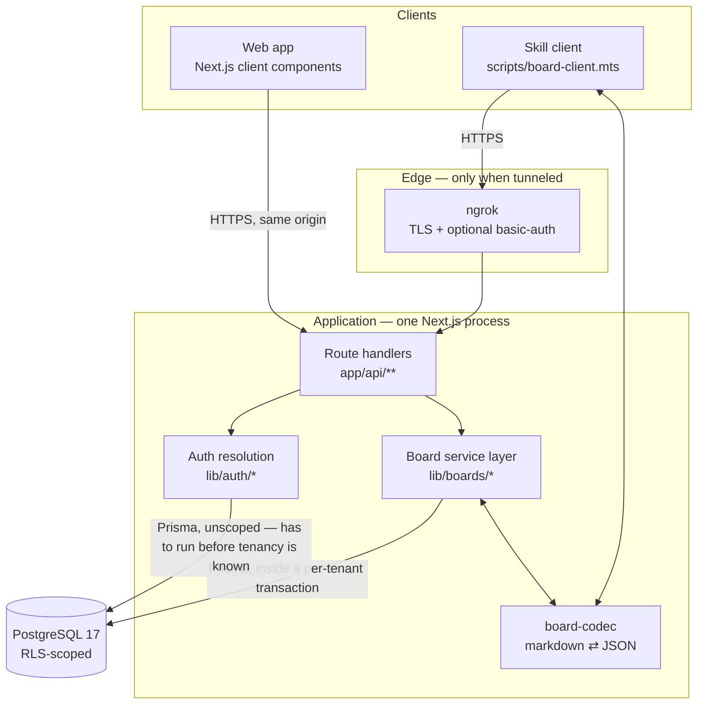
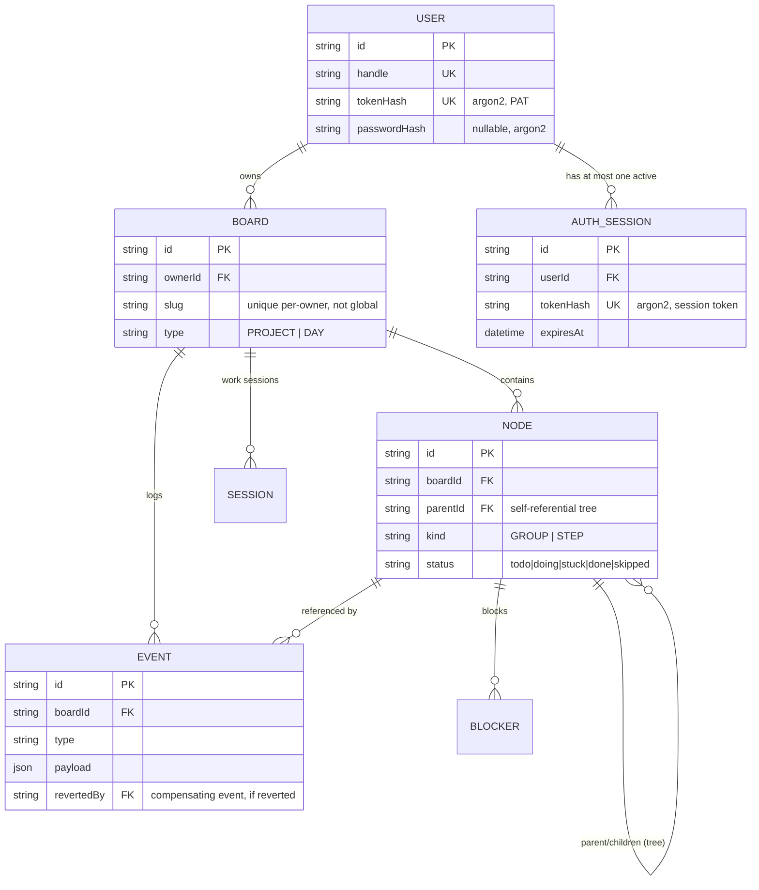
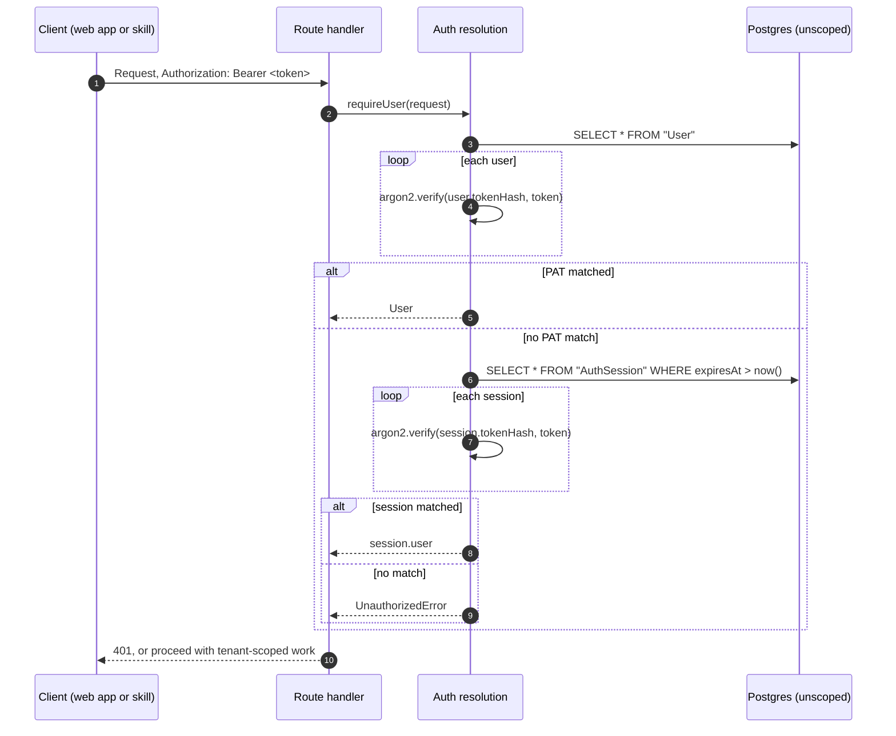
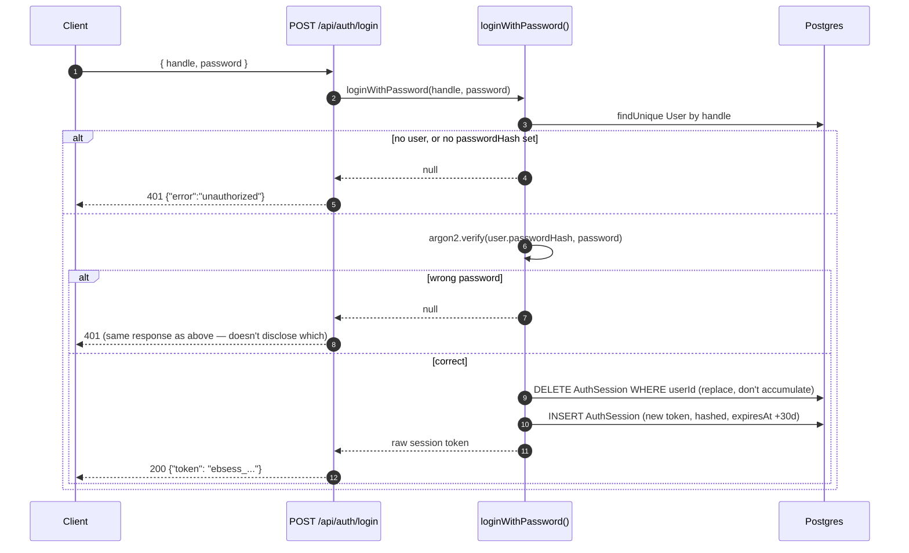
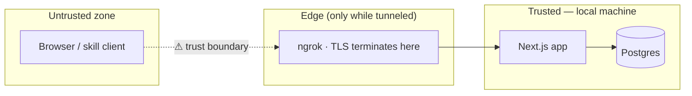
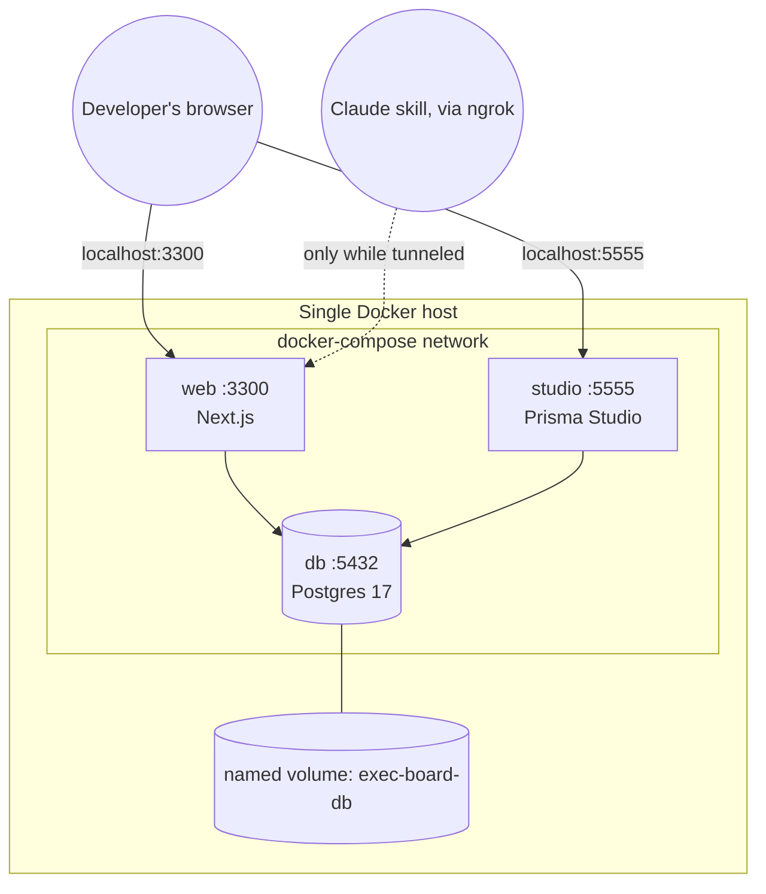

# Architecture — Exec Board

| Field | Value |
|---|---|
| **Status** | Living |
| **Version** | 0.1.0 |
| **Last updated** | 2026-08-12 |
| **Owners** | @JaxzTan |
| **Related docs** | [PRD](./docs/3%20Layers%20Rule%20PRD%20(1).md) · [TRD](./docs/3%20Layers%20Rule%20PRD%20(3).md) · [API reference](./docs/endpoint.md) · [Build history](./docs/list.md) · [Dual-login design doc](./docs/dual-login-plan.md) |
| **Audience** | Future-you, and anyone else who ends up reading this code |

---

## Table of Contents

1. [Overview](#1-overview)
2. [Goals, Non-Goals & Quality Attributes](#2-goals-non-goals--quality-attributes)
3. [Constraints & Assumptions](#3-constraints--assumptions)
4. [System Context (C4 L1)](#4-system-context-c4-l1)
5. [High-Level Architecture (C4 L2)](#5-high-level-architecture-c4-l2)
6. [Component Detail (C4 L3)](#6-component-detail-c4-l3)
7. [Data Architecture](#7-data-architecture)
8. [Interfaces & Contracts](#8-interfaces--contracts)
9. [Key Runtime Flows](#9-key-runtime-flows)
10. [State & Consistency Model](#10-state--consistency-model)
11. [Cross-Cutting Concerns](#11-cross-cutting-concerns)
12. [Security Model](#12-security-model)
13. [Performance & Capacity](#13-performance--capacity)
14. [Failure Modes & Resilience](#14-failure-modes--resilience)
15. [Deployment & Environments](#15-deployment--environments)
16. [Design Decisions](#16-design-decisions)
17. [Known Limitations & Tech Debt](#17-known-limitations--tech-debt)
18. [Evolution / Roadmap](#18-evolution--roadmap)
19. [Glossary](#19-glossary)
20. [References & Changelog](#20-references--changelog)

---

## 1. Overview

Exec Board is a persistent task board, tracked in three layers (project → task → subtask), that two different clients write to: a Claude skill (in-chat, infers status changes from conversation) and a Next.js web app (a person clicking around). It is a **server-rendered monolith** — one Next.js process serves both the UI and the REST API — backed by a single PostgreSQL database, with no queue, cache, or separate services.

**The single most important architectural property:** a board is a *history*, not a snapshot. Every mutation is recorded as an append-only `Event` before anything else is derived from it; `Node.status`, the "next action," step numbers, and progress counts are all either computed on read or a materialized fold over the event log that a repair job can rebuild. Nearly every other decision below follows from treating the event log, not the current row values, as the source of truth.

**One-paragraph mental model:**
> Two clients — a thin skill script and a browser — call the same REST API with the same bearer-token auth. Every write goes through the board service layer, which validates it, applies it inside a single transaction alongside the `Event` it produces, and returns the recomputed next action and counts so neither client has to derive them locally. Postgres row-level security, not just application-level `WHERE` clauses, keeps one user's boards invisible to another's queries. There is no realtime layer: every read is a normal HTTP request against current Postgres state.

---

## 2. Goals, Non-Goals & Quality Attributes

### 2.1 Goals

| # | Goal | Why it matters |
|---|---|---|
| G1 | One user can never read or mutate another user's board data, even via a bug in a single query | Two people (at minimum) share one database; a forgotten `WHERE ownerId = ?` must not be a leak |
| G2 | The skill and the web app can never diverge on what a board's markdown means | Two independent clients read/write the same format; a shared grammar owner (`board-codec`) is the only thing preventing drift |
| G3 | Every write is explainable and reversible | Most writes are *inferred* from conversation, not explicit commands — provenance and revert are how a wrong inference gets corrected without editing history |
| G4 | Losing `Node.status` to a bug is recoverable without restoring a backup | It's a materialized fold over `STATUS_CHANGED` events, not an independent fact |

### 2.2 Non-Goals

| # | Non-Goal | Rationale |
|---|---|---|
| NG1 | Multi-tenant SaaS / self-serve signup | Users are hand-provisioned via CLI (`scripts/issue-token.mts`, `scripts/set-password.mts`); this is a personal tool for a couple of people, not a product |
| NG2 | Horizontal scaling / multiple app instances | Single Next.js process is nowhere near saturated at this load; would also break the current per-request O(n) credential check (see §13) |
| NG3 | High availability / multi-region | One machine, one Postgres instance, no SLA |
| NG4 | Realtime updates (WebSocket, polling, SSE) | Boards are edited by one person or one inference at a time; a normal HTTP request/response cycle is sufficient |
| NG5 | Native mobile clients | Web app is responsive enough; not a stated requirement |

### 2.3 Quality Attributes

> Honest note: this project has never been load-tested. The attributes below are the ones actually exercised by the test suite (docs/list.md), not throughput/latency numbers pulled from nowhere.

| Attribute | Target | How it's checked | Status |
|---|---|---|---|
| Tenant isolation | A board/node a caller doesn't own is unreachable by id *or* slug | Automated cross-tenant test suite against a real (not mocked) Postgres, generated over the route table — asserts `404`, never `403` | ✅ Verified |
| Reversibility | Every mutation type either has a defined inverse or is explicitly rejected on revert | Table-driven tests over `STATUS_CHANGED`, `ATTR_SET`, `NODE_REWORDED`, `NODE_ADDED`, `NODE_CUT`; other types → `409` | ✅ Verified |
| Format fidelity | `board-codec` round-trips: parse → serialize → parse is idempotent | fast-check property tests (200+100 runs) + golden-file fixtures, including a hand-mangled one | ✅ Verified |
| Auth correctness | A PAT or a password credential resolves to exactly one user or to none | Unit tests over `resolveUser`/`requireUser`/`loginWithPassword` covering valid, wrong, expired, and unknown-handle cases | ✅ Verified |
| Latency / throughput | *(none set)* | Not load-tested | ⚠️ Unmeasured — see §13 |
| Availability | *(none set — best-effort, personal tool)* | N/A | N/A |

---

## 3. Constraints & Assumptions

### 3.1 Constraints

| Type | Constraint | Source |
|---|---|---|
| Technical | The app **must never connect to Postgres as the superuser at runtime** | RLS is a silent no-op for superuser connections (`lib/db.ts` throws at boot if `APP_DATABASE_URL` is missing) |
| Technical | Must run via `docker compose up` end-to-end, including the DB | Project convention (`Makefile`, `docker-compose.yml`) |
| Team | Solo-maintained, no fixed deadline | Personal project |
| Product | No self-serve account creation | Accounts are operator-issued, by design (§2.2 NG1) |

### 3.2 Assumptions

| Assumption | If false, then… |
|---|---|
| The user count stays small (a handful, not hundreds) | `resolveUser`'s O(n) per-request argon2-verify-against-every-user loop (§13) stops being cheap; would need an indexed lookup, which argon2's salted hashes don't support directly — a rethink, not a tweak |
| The host machine's owner is trusted | RLS constrains the *application*; anyone with `psql` access to the box bypasses it entirely (documented, accepted) |
| ngrok's free-tier hostname rotation is tolerable | If the skill needs a stable long-lived URL, a reserved domain or DNS indirection is needed (see §17, §18) |
| Board content is personal, not sensitive-regulated data | ngrok terminates TLS at its edge — content transits third-party infrastructure in plaintext at that hop |

---

## 4. System Context (C4 L1)


```mermaid
graph TB
    user([Person<br/>browser])
    claude([Claude Code session<br/>running the exec-board skill])
    operator([Operator<br/>you, via CLI scripts])

    subgraph system[" Exec Board "]
        core[Next.js app<br/>UI + REST API + Postgres]
    end

    ngrok[ngrok tunnel]

    user -->|HTTPS, direct or via tunnel| core
    claude -->|HTTPS, via ngrok tunnel| ngrok --> core
    operator -->|CLI scripts, direct DB/host access| core
```

### 4.1 Actors

| Actor | Type | Interacts via | Trust level |
|---|---|---|---|
| Person (you) | Human | Browser (SPA), directly or through ngrok | Authenticated (PAT or password) once logged in; all input validated server-side regardless |
| Claude Code session | System, acting on a person's behalf | `scripts/board-client.mts`, over the ngrok tunnel | Authenticated via a PAT (`EXEC_BOARD_TOKEN`) |
| Operator | Human | CLI scripts (`issue-token.mts`, `set-password.mts`, `backup-db.sh`) + direct host/DB access | Full — these scripts run with the Postgres superuser connection |

### 4.2 External dependencies

| Dependency | Purpose | Protocol | Failure impact | Fallback |
|---|---|---|---|---|
| ngrok | Exposes `localhost:3300` to the Claude skill sandbox | HTTPS tunnel | Skill can't reach the API | Skill client falls back to local-file mode (`.exec-board/` on disk) — a genuine, exercised fallback, not aspirational |

There is no OAuth provider, no email/SMTP, no CDN, and no third-party metrics backend — none are in the current design.

---

## 5. High-Level Architecture (C4 L2)


```mermaid
graph TB
    subgraph client[Clients]
        spa[Web app<br/>Next.js client components]
        skill[Skill client<br/>scripts/board-client.mts]
    end

    subgraph edge[Edge — only when tunneled]
        ngrok[ngrok<br/>TLS + optional basic-auth]
    end

    subgraph app[Application — one Next.js process]
        api[Route handlers<br/>app/api/**]
        svc[Board service layer<br/>lib/boards/*]
        auth[Auth resolution<br/>lib/auth/*]
        codec[board-codec<br/>markdown ⇄ JSON]
    end

    db[(PostgreSQL 17<br/>RLS-scoped)]

    spa -->|HTTPS, same origin| api
    skill -->|HTTPS| ngrok --> api
    api --> auth
    api --> svc
    svc -->|Prisma, inside a per-tenant transaction| db
    auth -->|Prisma, unscoped — has to run before tenancy is known| db
    svc <--> codec
    skill <--> codec
```

### 5.1 Container responsibilities

| Container | Owns | Explicitly does **not** own | Tech | Scaling unit |
|---|---|---|---|---|
| Web app (client components) | Rendering, optimistic-ish UI, input capture | Any authoritative state, any validation | React 19, Next.js App Router, TailwindCSS | N/A — served by the same process as the API |
| Skill client | Translating conversation into API calls; local-file fallback | Auth logic, board format parsing (delegates to `board-codec`) | Node/TS script | N/A |
| Route handlers | Request parsing (Zod), auth check, error→status mapping | Business logic (delegates to the service layer) | Next.js Route Handlers | Same process as everything else |
| Board service layer | Mutation logic, event emission, next-action derivation | HTTP concerns, auth | TypeScript, Prisma | " |
| Auth resolution | PAT/password verification, session-token minting | Tenant-scoped queries (runs *before* tenancy is known) | argon2, Prisma | " |
| `board-codec` | The markdown grammar, both directions | Persistence, HTTP | TypeScript (workspace package) | Runs in-process in both the skill script and the app |
| PostgreSQL | Durable state, row-level tenant isolation | Ephemeral/session state — there isn't any | Postgres 17, Docker Compose, named volume | 1 instance |

There is deliberately no separate reverse proxy, no cache, no queue, and no background worker process. ngrok is not an always-on edge — it only runs during an active tunnel session.

### 5.2 Communication matrix

| From ↓ / To → | Route handlers | Auth resolution | Service layer | Postgres |
|---|---|---|---|---|
| **Web app** | HTTPS/REST | — | — | — |
| **Skill client** | HTTPS/REST (via ngrok) | — | — | — |
| **Route handlers** | — | in-process call | in-process call | — |
| **Auth resolution** | — | — | — | Prisma, unscoped |
| **Service layer** | — | — | — | Prisma, inside `withTenant()` |

---

## 6. Component Detail (C4 L3)

### 6.1 `board-codec`

**Location:** `packages/board-codec/src/`
**Owner:** @JaxzTan

**Responsibility:**
> Sole owner of the markdown grammar. Parses markdown into a canonical JSON tree and serializes it back, losslessly.

**Public interface:** `parse`, `serialize` (see `packages/board-codec/src/index.ts`), operating on a discriminated `GroupNode | StepNode` union.

**Internal structure:**

| File | Role |
|---|---|
| `parse.ts` | Markdown → canonical JSON. Lenient: malformed lines are preserved in `unparsed` + a warning, never thrown |
| `serialize.ts` | Canonical JSON → markdown. Deterministic, round-trips through the same parser |
| `numbering.ts` | Global (not per-phase) step numbering — a golden-test-caught bug fix; per-phase numbering made cross-phase note/blocker references ambiguous |
| `types.ts` | The canonical JSON schema (`formatVersion: 1`) |

**Depends on:** nothing else in this repo — it's a standalone workspace package.
**Depended on by:** the board service layer (`lib/boards/markdown.ts`) and the skill client (`scripts/board-client.mts`).

**Does NOT own:** persistence, HTTP, or any notion of "which board" — it's a pure format transform.

**Invariants:** parse→serialize→parse is idempotent; serialize→parse round-trips to the same tree. Verified by 200+100-run property tests and a fixture corpus that includes a deliberately mangled file.

### 6.2 Board service layer

**Location:** `lib/boards/`
**Owner:** @JaxzTan

**Responsibility:**
> Every board/node mutation, its accompanying `Event`, and the derived next-action/counts — all inside one transaction.

**Key files:** `service.ts` (board CRUD), `mutations.ts` (node add/patch/note), `sessions.ts`, `revert.ts`, `rebuild.ts`, `markdown.ts` (import/export via `board-codec`), `report.ts`, `nextAction.ts`, `tree.ts` (numbering).

**Depends on:** `lib/db.ts` (`withTenant()` — the only way this layer touches Postgres), `board-codec`.
**Depended on by:** every route handler under `app/api/boards/**`.

**Does NOT own:** HTTP request/response shape, auth — a route handler resolves the user first and passes `userId` in.

**Invariants:** a mutation and its `Event` are always in the same transaction (never one without the other); `Node.status` is only ever written alongside the `STATUS_CHANGED` event that justifies it.

### 6.3 Auth resolution

**Location:** `lib/auth/`
**Owner:** @JaxzTan

**Responsibility:**
> Turn an `Authorization: Bearer <token>` header into a `User`, regardless of whether the token is a PAT or a password-login session token.

**Key files:** `tokens.ts` (argon2 hash/verify, token generation), `tenant.ts` (`resolveUser`/`requireUser`), `service.ts` (`loginWithPassword`), `schemas.ts`.

**Depends on:** `lib/db.ts` (the *unscoped* `prisma` client — has to read across all users before it knows who the tenant is), `@node-rs/argon2`.
**Depended on by:** every route handler (`requireUser(request)`), `app/api/auth/login/route.ts`.

**Does NOT own:** tenant-scoped queries — once a `User` is resolved, everything downstream goes through `withTenant()`, not this module.

**Invariants:** a PAT and a session token are verified independently and never confused; a failed lookup never distinguishes *why* (unknown handle vs. wrong password vs. no password set) in its response.

---

## 7. Data Architecture

### 7.1 Storage map & ownership

There is exactly one datastore (PostgreSQL) and exactly one writer (the Next.js app itself — no worker, no external system writes to it).

| Table | Data | Sole writer | Durability | Retention |
|---|---|---|---|---|
| `User` | Identity, PAT hash, password hash | Operator scripts (`issue-token.mts`, `set-password.mts`) + `loginWithPassword` (session rotation only) | Durable | Until deleted |
| `AuthSession` | Password-login session tokens | `lib/auth/service.ts` | Durable, but treated as ephemeral (30-day expiry, one per user) | 30 days, or replaced on next login |
| `Board`, `Node`, `Event`, `Blocker`, `Session`, `Import`, `Report` | Board content and its full history | Board service layer, inside `withTenant()` | Durable | Forever (nothing is hard-deleted; cuts/archives are soft) |

### 7.2 Logical model


```mermaid
erDiagram
    USER ||--o{ BOARD : owns
    USER ||--o{ AUTH_SESSION : "has at most one active"
    BOARD ||--o{ NODE : contains
    BOARD ||--o{ EVENT : logs
    BOARD ||--o{ SESSION : "work sessions"
    NODE ||--o{ NODE : "parent/children (tree)"
    NODE ||--o{ BLOCKER : blocks
    NODE ||--o{ EVENT : "referenced by"

    USER {
        string id PK
        string handle UK
        string tokenHash UK "argon2, PAT"
        string passwordHash "nullable, argon2"
    }
    AUTH_SESSION {
        string id PK
        string userId FK
        string tokenHash UK "argon2, session token"
        datetime expiresAt
    }
    BOARD {
        string id PK
        string ownerId FK
        string slug "unique per-owner, not global"
        string type "PROJECT | DAY"
    }
    NODE {
        string id PK
        string boardId FK
        string parentId FK "self-referential tree"
        string kind "GROUP | STEP"
        string status "todo|doing|stuck|done|skipped"
    }
    EVENT {
        string id PK
        string boardId FK
        string type
        json payload
        string revertedBy FK "compensating event, if reverted"
    }
```

The one deliberate denormalization: `Node.status` is a materialized fold over `STATUS_CHANGED` events. It's stored because every read path needs it, but it's only ever written inside the same transaction as the event that justifies it — `POST /api/boards/:slug/rebuild` replays the log and repairs it, which is what keeps it a cache rather than a second source of truth.

### 7.3 Tenancy

`User.id` and `Board.ownerId` are the only tenancy structures; every child row (`Node`, `Event`, `Blocker`, `Session`, `Import`, `Report`) carries no `ownerId` of its own and inherits tenancy through `boardId`. Consequences:

- `slug` is `@@unique([ownerId, slug])`, never globally unique — global uniqueness would let one user's board name block or leak the existence of another's.
- Every child-row access goes through its board (`where: { id, board: { ownerId } }`) or through RLS — never a bare `findUnique` by id.
- Cross-tenant access returns `404`, never `403` (a `403` would confirm the board exists under that slug for someone else).
- `User` itself is **not** RLS-scoped and can't be — resolving a bearer token to a user has to read across all users before tenancy is known. Same reasoning extends to `AuthSession`.

### 7.4 Migrations, seeding, backup

- **Migration tool:** Prisma Migrate, forward-only.
- **RLS is hand-written SQL** inside a migration (`20260723030110_tenancy_rls`) — Prisma's schema language has no RLS primitive, so it's raw `CREATE POLICY` statements Prisma can't diff against `schema.prisma`. This is a known source of "drift" that CI's `prisma migrate diff --exit-code` job exists specifically to catch.
- **Seed data:** none automated — users are created on demand via `scripts/issue-token.mts <handle>` / `scripts/set-password.mts <handle> <password>`, each an idempotent upsert.
- **Backup:** `scripts/backup-db.sh` — `pg_dump --format=custom`, prunes anything older than `EXEC_BOARD_BACKUP_RETENTION_DAYS` (default 14). Not run on a schedule by default; see §17.

---

## 8. Interfaces & Contracts

### 8.1 Contract inventory

| Interface | Style | Consumer | Spec |
|---|---|---|---|
| Public API | REST/JSON | Web app, skill client | [`docs/endpoint.md`](./docs/endpoint.md) |

That's the only interface. There is no WebSocket layer, no internal RPC between services (there's only one service), and no gRPC/proto contract — this section is intentionally short.

### 8.2 REST conventions

- **Auth:** `Authorization: Bearer <PAT or session token>` on every route except `GET /api/health` and `POST /api/auth/login`.
- **Error envelope** (`lib/api/http.ts::handleRouteError`) — the actual shape used everywhere, not a hypothetical one:

```json
{ "error": "bad_request", "issues": { /* Zod's flattened error, when applicable */ } }
{ "error": "unauthorized" }
{ "error": "not_found" }
{ "error": "conflict", "message": "..." }
{ "error": "internal_error" }
```

- **Status codes:** `400` validation/malformed JSON · `401` missing/invalid bearer token · `404` absent *or* not the caller's (never `403`, see §7.3) · `409` conflict (e.g. a second `doing` step, re-reverting an already-reverted event) · `5xx` unexpected, logged server-side, never leaks internals to the caller.
- **Pagination:** none implemented — board node/event counts are small enough that every list endpoint returns everything.
- **Idempotency:** PAT/password issuance are upserts by `handle`; password-login session creation replaces the prior session rather than accumulating one per call.

### 8.3 Compatibility policy

No external consumers beyond this repo's own two clients, both updated in lockstep with the API — no versioning scheme is in place or currently needed.

---

## 9. Key Runtime Flows

### 9.1 Bearer token resolution (every authenticated request)


```mermaid
sequenceDiagram
    autonumber
    participant C as Client (web app or skill)
    participant R as Route handler
    participant A as Auth resolution
    participant D as Postgres (unscoped)

    C->>R: Request, Authorization: Bearer <token>
    R->>A: requireUser(request)
    A->>D: SELECT * FROM "User"
    loop each user
        A->>A: argon2.verify(user.tokenHash, token)
    end
    alt PAT matched
        A-->>R: User
    else no PAT match
        A->>D: SELECT * FROM "AuthSession" WHERE expiresAt > now()
        loop each session
            A->>A: argon2.verify(session.tokenHash, token)
        end
        alt session matched
            A-->>R: session.user
        else no match
            A-->>R: UnauthorizedError
        end
    end
    R-->>C: 401, or proceed with tenant-scoped work
```

**Notes:** the O(n) loop is a deliberate tradeoff, not an oversight — see §13. A malformed hash on one row (bad data, mid-rotation) is caught per-row so it can't break resolution for every other user.

### 9.2 Password login


```mermaid
sequenceDiagram
    autonumber
    participant C as Client
    participant R as POST /api/auth/login
    participant S as loginWithPassword()
    participant D as Postgres

    C->>R: { handle, password }
    R->>S: loginWithPassword(handle, password)
    S->>D: findUnique User by handle
    alt no user, or no passwordHash set
        S-->>R: null
        R-->>C: 401 {"error":"unauthorized"}
    else
        S->>S: argon2.verify(user.passwordHash, password)
        alt wrong password
            S-->>R: null
            R-->>C: 401 (same response as above — doesn't disclose which)
        else correct
            S->>D: DELETE AuthSession WHERE userId (replace, don't accumulate)
            S->>D: INSERT AuthSession (new token, hashed, expiresAt +30d)
            S-->>R: raw session token
            R-->>C: 200 {"token": "ebsess_..."}
        end
    end
```

### 9.3 A mutation: changing a node's status

```mermaid
sequenceDiagram
    autonumber
    participant C as Client
    participant R as PATCH /api/boards/:slug/nodes/:id
    participant S as Board service (withTenant)
    participant D as Postgres

    C->>R: { status: "doing" }, Bearer token
    R->>R: requireUser → userId
    R->>S: patchNode(userId, slug, nodeId, input)
    S->>D: BEGIN; SET app.current_user_id
    S->>D: check: no other Node has status="doing" on this board
    alt conflict
        D-->>S: violates partial unique index
        S-->>R: ConflictError
        R-->>C: 409
    else ok
        S->>D: UPDATE Node SET status, statusAt
        S->>D: INSERT Event (type: STATUS_CHANGED, payload, source, ambiguous)
        S->>D: COMMIT
        S->>S: resolveNextAction(), recompute counts
        S-->>R: { node, nextAction, counts }
        R-->>C: 200
    end
```

**Notes:** the status write and its `Event` are always in the same transaction — there is no code path that can produce one without the other.

---

## 10. State & Consistency Model

### 10.1 Where state lives

There is no in-memory session/application state to speak of — the app is stateless between requests. Everything durable lives in Postgres; everything else (React state in the browser, the skill script's process) is either derived or thrown away on restart.

| State | Location | Lifetime | Authority |
|---|---|---|---|
| Board content, events, users | Postgres | Permanent | The app (sole writer) |
| A PAT / session token | Client-side `localStorage` (web) or `.env` (skill) | Until logout/rotation | Not authoritative — just a credential; Postgres is |
| UI state (open dialogs, form drafts) | Browser, React state | Tab lifetime | Irrelevant to correctness |
| Skill's local-file fallback (`.exec-board/`) | Disk, on the machine running the skill | Until the API is reachable again | A stand-in for the real board, reconciled manually — not synced automatically |

### 10.2 Authority rules

- Postgres is the only source of truth. Neither client derives `nextAction`, step numbers, or counts locally — every mutation response includes the server-recomputed values.
- The skill's local-file fallback is explicitly *not* authoritative — it's what the skill writes to when the API is unreachable, not a second copy of the truth.

### 10.3 Consistency guarantees

| Path | Guarantee | Rationale |
|---|---|---|
| Any board mutation | Strong — single Postgres primary, transactional, mutation + event committed together | Correctness matters more than latency at this scale; there's no reason to trade it away |
| Reads | Strong — same Postgres, no read replica, no cache | Simplicity; nothing to invalidate |

### 10.4 Stickiness & session affinity

Not applicable. There is one app process, no in-memory per-session state, and therefore no routing/affinity concern.

### 10.5 Idempotency & ordering

- `issue-token.mts` / `set-password.mts` are upserts keyed by `handle` — re-running for the same handle rotates the credential rather than erroring or duplicating.
- A password login always deletes-then-creates the user's `AuthSession`, so repeated logins never accumulate rows.
- Within one board, event ordering is Postgres's insertion order (`at` timestamp + id); there's no cross-board ordering guarantee or need for one.

---

## 11. Cross-Cutting Concerns

### 11.1 Authentication & authorization

| Aspect | Approach |
|---|---|
| AuthN | Either a PAT (argon2-hashed, shown once at issuance, never expires) or a password login (mints a 30-day `AuthSession` token) |
| Default posture | Deny by default — every route calls `requireUser(request)` except the two explicitly public ones |
| AuthZ model | Ownership only — a board belongs to exactly one `User`; no roles, no sharing, no admin tier |
| Token storage | `localStorage` on the web client (`lib/client/api.ts`) — a deliberate, accepted deviation from the httpOnly-cookie norm; this is a bearer-token API by design (TR-14), and a plain `<a href>` can't carry a bearer header anyway, which is why downloads go through `fetch` + `Blob` instead of direct navigation |
| Revocation | A PAT can only be revoked by rotating it (re-running `issue-token.mts`, which overwrites the hash). A session token can be revoked by any subsequent login (replaces it) — there's no explicit "log out everywhere" |

### 11.2 Configuration & secrets

- **Source:** env vars only, read from `.env` (gitignored) locally or `docker-compose.yml`'s `environment:` block in containers.
- **Validation:** minimal and ad hoc — `lib/db.ts` throws at import time if `APP_DATABASE_URL` is missing; most other config is read where used, without a central schema. *(Known gap — see §17.)*
- **Secrets:** PATs and passwords are argon2-hashed at rest; the RLS app role's real Postgres password is synced from `.env` via `scripts/setup-db-role.sh` rather than baked into a migration file.

### 11.3 Observability

Minimal by design, matching the scale: server errors are logged via `console.error` inside `handleRouteError` before returning a generic `500`. There is no structured logging, no metrics endpoint, and no tracing. *(Known gap — see §17; not a priority at 2 users.)*

### 11.4 Error handling

- Domain errors (`UnauthorizedError`, `NotFoundError`, `ConflictError`, Zod's `ZodError`) are typed and mapped to HTTP status/shape at the boundary (`lib/api/http.ts`); anything else becomes a logged, opaque `500`.
- No retry logic anywhere — there's nothing flaky enough in this system's own dependencies (one local Postgres) to warrant it. The one place retries matter is the skill client's reachability probe (`GET /api/health`), which decides API-vs-local-file mode per call rather than retrying.

### 11.5 Validation

Every mutating route validates its body with a Zod schema (`lib/boards/schemas.ts`, `lib/auth/schemas.ts`) before the service layer ever sees it; the service layer assumes validated input and does not re-validate. `stuck`-requires-`blocker` and reword/cut-requires-`reason` are enforced at the schema level via `.refine()`, not scattered `if` checks downstream.

### 11.6 Concurrency model

Single Node.js process, single-threaded event loop — no shared mutable memory to reason about. The only real concurrency concern is two mutations racing on the same board, which Postgres's transactions and a partial unique index (`Node_one_doing_per_board`) resolve at the database level, not in application code.

### 11.7 Internationalization

Real and in place: `lib/client/i18n.tsx` provides English and Chinese, locale persisted to `localStorage`, keys returned by `t(key)` — the server never returns user-facing prose, only error codes, so the client owns all translation.

### 11.8 Rate limiting & abuse

None implemented. Acceptable at the current scale (a handful of trusted, hand-provisioned users) but would need addressing before this ever faced untrusted traffic — see §17.

---

## 12. Security Model

### 12.1 Trust boundaries


```mermaid
graph LR
    subgraph untrusted[Untrusted zone]
        browser[Browser / skill client]
    end
    subgraph edge["Edge (only while tunneled)"]
        ngrok[ngrok · TLS terminates here]
    end
    subgraph trusted[Trusted — local machine]
        app[Next.js app]
        db[(Postgres)]
    end
    browser -.->|"⚠ trust boundary"| ngrok --> app --> db
```

### 12.2 Controls

| Threat | Control |
|---|---|
| Credential stuffing / brute force | Argon2 hashing (slow by design); no rate limiting yet (§11.8, §17) |
| Cross-tenant data access | Postgres RLS keyed on `app.current_user_id`, set inside the same transaction as every tenant-scoped query — never a window where a query can run before scope is set |
| Handle/credential enumeration | `POST /api/auth/login` returns the identical `401` whether the handle is unknown, the password is wrong, or the user has no password set |
| Client tampering with derived values | Server recomputes `nextAction`/counts/step numbers on every mutation response; neither client's local copy is trusted |
| Secrets in git | `.env` gitignored; RLS app-role password set post-migration by `scripts/setup-db-role.sh`, never committed |
| SQL injection | Prisma parameterizes everything; no string-built SQL anywhere in the app |
| Transport | ngrok terminates TLS at its edge — see the accepted-risk note below |

### 12.3 Data classification

| Class | Examples | Handling |
|---|---|---|
| Secret | `tokenHash`, `passwordHash`, `AuthSession.tokenHash` | Argon2-hashed, never logged, raw value shown exactly once at issuance |
| Personal | Board content, notes | Stored in plaintext in Postgres — this is a personal task tracker, not handling third-party PII |
| Public-ish | `handle` | Not secret, but not globally enumerable via the API either (§12.2) |

**Accepted risk:** ngrok terminates TLS at its edge, so board content transits third-party infrastructure in plaintext at that hop — acceptable for a personal tool, worth revisiting if boards ever hold non-personal material. The host machine's owner can always read the database directly via `psql`; RLS constrains the application, not the host (§3.2).

---

## 13. Performance & Capacity

No load testing has been done on this project — the numbers below are honest gaps, not omissions.

**The one real, deliberate performance tradeoff:** `resolveUser` verifies a bearer token against *every* user's stored hash in a loop (`lib/auth/tenant.ts`), for both PATs and `AuthSession` tokens. This is O(n) in user count per authenticated request, and it's O(n) *on purpose* — argon2's hashes are salted, so there's no way to do an indexed `WHERE tokenHash = hash(token)` lookup without either using a fast (and weaker) hash for the lookup key or maintaining a second, unsalted index. At the project's actual scale (a small handful of users), verifying against each one is simply cheaper than the complexity of a workaround. **This stops being the right call if the user count grows meaningfully** — see §18.

| Path | Budget | Measured |
|---|---|---|
| Any request | *(none set)* | Not benchmarked |

**Capacity model:** trivial at current scale — one Postgres instance, one Next.js process, a handful of users, no queue depth to reason about.

---

## 14. Failure Modes & Resilience

| # | Failure | Detection | Behaviour | Blast radius | Mitigation |
|---|---|---|---|---|---|
| F1 | Postgres unavailable | Query throws | Route handler's `500` path (`handleRouteError`) | Entire app — there's no fallback for the web client | Restart Postgres; Docker Compose's healthcheck gates the app container's startup |
| F2 | ngrok tunnel down | Skill's `GET /api/health` probe fails | Skill client falls back to `.exec-board/` local files | Only the skill's reach into the app; the web app is unaffected if it's not going through the tunnel | Genuinely implemented fallback, not aspirational — this is the one real resilience feature in the system |
| F3 | `Node.status` drifts from the event log (bug, manual DB edit) | Manual trigger, or suspicion | `POST /api/boards/:slug/rebuild` replays `STATUS_CHANGED` events and reports/fixes mismatches | One board at a time, on demand | Verified by deliberately corrupting a status and confirming the job catches and repairs it |
| F4 | Malformed `tokenHash`/`passwordHash` on one row | Argon2 throws during verify | Caught per-row inside the resolution loop, treated as a non-match | That one user can't log in; every other user is unaffected | Explicit `try/catch` in `resolveUser`, not a blanket assumption of clean data |
| F5 | Volume/disk loss, or `docker compose down -v` | None automated | Total data loss — no automatic backup, no offsite copy | Everything | `scripts/backup-db.sh` exists but isn't scheduled by default (§17) |
| F6 | `.env` malformed (a missing `=`, etc.) | Any script that `source`s it fails loudly (`command not found`) | Backup and role-sync scripts fail; the Next.js app itself is unaffected since Docker Compose reads `.env` through its own parser, not bash `source` | Backup/ops scripts only | Fix the line; no automated linting of `.env` currently |

**Degradation ladder:** there isn't a formal one — this is a single-machine personal tool. In practice: Postgres down → app fully down for the web client, skill falls back to local files → operator restarts Postgres.

---

## 15. Deployment & Environments

### 15.1 Topology


```mermaid
graph TB
    subgraph host[Single Docker host]
        subgraph net[docker-compose network]
            web[web :3300<br/>Next.js]
            studio[studio :5555<br/>Prisma Studio]
            db[(db :5432<br/>Postgres 17)]
        end
        vol[(named volume: exec-board-db)]
    end
    dev((Developer's browser)) -->|localhost:3300| web
    dev -->|localhost:5555| studio
    skill((Claude skill, via ngrok)) -.->|only while tunneled| web
    web --> db
    studio --> db
    db --- vol
```

`web` and `studio` are published to the host on `3300`/`5555`; `db` is bound to `127.0.0.1` only. There is no reverse proxy — Next.js serves both the UI and the API directly.

### 15.2 Environments

There is exactly one real environment (local/personal), plus CI's fully ephemeral one. No staging, no production — see NG3 (§2.2). This is a stated simplification, not an oversight.

| Env | Purpose | Data | Deploy trigger |
|---|---|---|---|
| local | The only place this app runs day-to-day | Real, on a named Docker volume | `make up` / `make dev` |
| CI | Automated tests | Ephemeral Postgres service container, torn down after the run | Every PR and push to `main` |

### 15.3 Build & release

- **Image:** single-stage (`node:24-alpine`, `npm install`, `prisma generate`, `CMD npm run dev`) — a dev-mode container, not a production-optimized multi-stage build. Deliberate given there's no production environment to optimize for; flagged as a known simplification in §17.
- **`npm ci` doesn't work in the container and had to become `npm install`** — the lockfile was generated on macOS/arm64; native packages (`@node-rs/argon2`, `lightningcss`, `sharp`) ship optional per-platform variants that `npm ci`'s strict parity check rejects on Linux.
- **Pipeline (`.github/workflows/ci.yml`):** four parallel/sequenced jobs — `typecheck` (tsc + eslint), `test` (Vitest against a real ephemeral Postgres), `e2e` (Playwright, depends on typecheck+test passing first), and `prisma-migrate-check` (`prisma migrate diff --exit-code`, catching the RLS-migration-drift risk noted in §7.4).
- **Rollback:** not formalized — `git revert` + redeploy, same as any small project. Migrations are forward-only; no down-migrations are maintained.

### 15.4 Operational runbook pointers

| Situation | Action |
|---|---|
| Restore DB | `pg_restore` from a `scripts/backup-db.sh` dump — restoration itself hasn't been rehearsed end-to-end (see §17) |
| Rotate a PAT | `node scripts/issue-token.mts <handle>` — upserts, old token stops working immediately |
| Set/rotate a password | `node scripts/set-password.mts <handle> <password>` |
| Sync the RLS app role's password after a fresh migration | `bash scripts/setup-db-role.sh` (needed because the migration sets a placeholder password) |

---

## 16. Design Decisions

### ADR-001 — Postgres row-level security instead of query-level scoping only

- **Status:** Accepted
- **Context:** Two or more users share one database. A single forgotten `WHERE ownerId = ?` in application code is a cross-tenant data leak.
- **Alternatives considered:**
  | Option | Pros | Cons | Verdict |
  |---|---|---|---|
  | App-level scoping only (`WHERE ownerId = ?` everywhere) | Simple, no DB-level setup | One missed clause anywhere in the codebase is a silent leak, forever | Rejected |
  | Postgres RLS, tenant set per-transaction | Leak is prevented at the DB layer even if application code forgets | Requires an unprivileged app role (RLS is a no-op for superusers) + a Prisma extension since Prisma has no native per-transaction session-variable hook | **Chosen** |
- **Consequences / cost accepted:** every tenant-scoped query must go through `withTenant()`; migrations need a separate unprivileged role (`exec_board_app`) whose password lives outside version control and has to be synced (`scripts/setup-db-role.sh`) after any migration that touches the role.

### ADR-002 — Bearer PAT instead of session cookies or OAuth (initially)

- **Status:** Accepted, extended by ADR-003
- **Context:** Two known users, no public signup, and a non-browser client (the skill script) that needs to authenticate too.
- **Decision:** One argon2-hashed personal access token per user, sent as `Authorization: Bearer`, issued via CLI.
- **Consequences:** no cookie/CSRF machinery needed; but also no browser-native credential UX — a PAT has to be copy-pasted, which is what motivated ADR-003.

### ADR-003 — Password login mints a separate session token rather than rotating the PAT

- **Status:** Accepted (full rationale: [`docs/dual-login-plan.md`](./docs/dual-login-plan.md))
- **Context:** Adding username+password login is friendlier than pasting a PAT, but a PAT's hash is one-way — a password login *cannot* hand back the original PAT.
- **Alternatives considered:**
  | Option | Pros | Cons | Verdict |
  |---|---|---|---|
  | Rotate the PAT on password login, return the new one | No new table | Silently invalidates any PAT already in use elsewhere (e.g. the skill client) the moment someone logs in via browser | Rejected |
  | Separate `AuthSession` table, independent expiring token | Doesn't touch the PAT at all | One more table, one more code path in `resolveUser` | **Chosen** |
- **Consequences / cost accepted:** `resolveUser` now checks two hash tables instead of one (still O(n) each, see §13); a password login replaces the user's prior session token rather than allowing multiple concurrent ones, to keep `AuthSession` bounded.

### ADR-004 — `board-codec` as a single shared package, not two parsers

- **Status:** Accepted
- **Context:** Two clients (skill, web app) both need to read/write the same markdown grammar.
- **Decision:** One TypeScript workspace package, imported by both, is the only thing that knows the grammar.
- **Consequences:** the grammar had to be designed from scratch (the PRD/TRD describe *behavior*, not a literal format) — but a bug can only exist in one place, and did: global vs. per-phase step numbering, caught by golden tests before it shipped.

### ADR-005 — No hosted deployment; Docker Compose + ngrok on one machine

- **Status:** Accepted
- **Context:** This is a personal tool for a couple of people, not a product with users to serve reliably.
- **Decision:** Everything runs on one developer machine; ngrok exposes it to the Claude skill sandbox only while actively tunneled.
- **Consequences / cost accepted:** no uptime guarantee, no staging environment, a dev-mode (not production-optimized) Docker image, and the ngrok free-tier hostname-rotation problem (§17). All accepted deliberately — see NG2/NG3 (§2.2).

### Decision index

| ID | Decision | Status |
|---|---|---|
| ADR-001 | Postgres RLS for tenancy | Accepted |
| ADR-002 | Bearer PAT auth | Accepted, extended |
| ADR-003 | Password login via separate session token | Accepted |
| ADR-004 | Single shared `board-codec` package | Accepted |
| ADR-005 | Single-machine deployment, no hosting | Accepted |

---

## 17. Known Limitations & Tech Debt

| # | Limitation | Impact | Why accepted | Exit condition |
|---|---|---|---|---|
| L1 | `resolveUser`'s O(n) argon2-verify loop, doubled by ADR-003's second table | Auth cost grows linearly with user count | Genuinely cheap at current scale (§13) | Move to an indexed lookup (e.g. an unsalted lookup key alongside the salted hash) if user count grows meaningfully |
| L2 | No automated backup schedule | A disk failure or `docker compose down -v` is unrecoverable | Script exists (`scripts/backup-db.sh`); scheduling it hit a real macOS TCC/Full-Disk-Access wall (`~/Documents` is protected from non-interactive processes regardless of cron vs. launchd) that needs a one-time manual System Settings grant | Grant Full Disk Access to `/bin/bash`, then either cron or the already-installed `launchd` job (`~/Library/LaunchAgents/local.exec-board.backup-db.plist`) starts working |
| L3 | Backup restoration has never been rehearsed end-to-end | Unknown whether a restore actually works under pressure | Time | Do a real restore-to-a-scratch-database drill |
| L4 | No structured logging/metrics/tracing | Debugging a production-like issue relies on `console.error` output only | Not a priority at 2 users, no ops team | Add before this ever needs to be debugged by someone who isn't the person who wrote it |
| L5 | No rate limiting | An untrusted or compromised client could hammer the login endpoint | Users are hand-provisioned and trusted today | Needed before this ever faces untrusted traffic |
| L6 | ngrok free-tier hostname rotates on restart | The skill's tunnel URL isn't stable across restarts | Zero-cost, zero-infra | Reserved domain, or a small DNS-indirection layer |
| L7 | `Board.parallelAllowed` field exists in the schema, unused | Dead schema surface | A TRD-described escape hatch (allow two `doing` steps at once) that was never wired up, pending a decision to drop it | Either implement it or drop the column in a migration |
| L8 | Docker image is dev-mode only (`npm run dev` as the container `CMD`) | Not representative of a production build; slower cold start, no minification | No production environment exists to optimize for (ADR-005) | Add a production Dockerfile stage if that ever changes |
| L9 | `.env` has no schema validation — a malformed line silently breaks whatever `source`s it, per-script, at run time | Confusing failures (`command not found` from an unrelated-looking line) | Small number of scripts, each easy to debug individually | A startup-time `.env` schema check (e.g. via zod) across all scripts that read it |

---

## 18. Evolution / Roadmap

| Horizon | Change | Trigger | Prep already in place |
|---|---|---|---|
| Near | Schedule `backup-db.sh` (cron or the installed `launchd` job) | Any time — currently blocked only on a manual Full Disk Access grant | Script, `launchd` plist, and the one-line crontab entry are all already written (§17 L2) |
| Near | Reserved ngrok domain | Tunnel URL instability becomes annoying enough | None yet — small, isolated change (`scripts/start-tunnel.sh`) |
| Mid | Indexed credential lookup instead of O(n) argon2-verify-all | User count grows past "a handful" | The two lookup loops (`findUserByPat`, `findUserBySessionToken` in `lib/auth/tenant.ts`) are already isolated behind `resolveUser`, so the swap is localized |
| Mid | `.env` schema validation | The next time a malformed `.env` line causes a confusing failure (has already happened once) | None yet |
| Far | Structured logging / metrics | This is ever debugged by someone other than its author, or genuinely goes into daily heavier use | None yet |
| Far | Decide `Board.parallelAllowed`'s fate | Whenever someone actually wants concurrent `doing` steps, or decides they never will | Field already exists in the schema either way |

**Extension points:** a new board node attribute plugs in by extending `Node`'s schema + `patchNodeSchema` + the relevant `Event` payload shape — the service layer, event log, and next-action resolver don't need to change for most additive attributes (`due`/`prio`/`owner`/`quadrant` all followed this path already).

---

## 19. Glossary

| Term | Meaning |
|---|---|
| Node | One row in the three-layer tree — a `GROUP` (project/phase) or a `STEP` (task/subtask) |
| Event | An append-only log entry recording one mutation; the source of truth `Node.status` is folded from |
| Next action | The single most-actionable step, derived server-side (phase → priority → position), never stored |
| PAT | Personal access token — one per user, argon2-hashed, shown once, doesn't expire |
| **`Session`** (board) | A work session on a board (`Session` model) — drives report generation and the session counter. **Not the same thing as:** |
| **`AuthSession`** | A password-login credential — an expiring bearer token, unrelated to work sessions above. The naming collision is real; disambiguate by full model name, not just "session" |
| `board-codec` | The shared package owning the markdown ⇄ JSON grammar |
| RLS | Row-level security — Postgres's per-row access policy, keyed here on a per-transaction `app.current_user_id` setting |
| Revert | A compensating `Event` that undoes another's effect; nothing is ever deleted |

---

## 20. References & Changelog

### References

- [PRD](./docs/3%20Layers%20Rule%20PRD%20(1).md) / [TRD](./docs/3%20Layers%20Rule%20PRD%20(3).md) — the original spec this system implements
- [`docs/list.md`](./docs/list.md) — phase-by-phase build history and the decisions made along the way (the primary source for most of this document)
- [`docs/endpoint.md`](./docs/endpoint.md) — full API reference
- [`docs/dual-login-plan.md`](./docs/dual-login-plan.md) — the design doc behind ADR-003

### Changelog

| Date | Version | Change |
|---|---|---|
| 2026-07-23 | 0.1.0 | Initial 8-phase build: board-codec, Prisma schema, RLS tenancy, Board API, skill client, web app, testing, CI |
| 2026-07-23 | 0.1.0 | Post-phase-8 addition: Next.js-in-Docker + Makefile |
| 2026-08-12 | 0.1.0 | Dual login (PAT or username+password) — `AuthSession` model, `POST /api/auth/login`, tabbed login UI |
| 2026-08-12 | 0.1.0 | This document restructured to the current template |

---

<details>
<summary><strong>Maintenance rules (keep this — it's how the doc stays alive)</strong></summary>

1. **Update triggers:** a new container, a changed boundary, a new external dependency, or a reversed decision. Cosmetic refactors do not touch this file.
2. **Definition of done for a PR that changes architecture:** the diagram and the affected table are updated in the same PR.
3. **Anything volatile lives elsewhere.** File listings, function signatures, endpoint tables → code, `docs/endpoint.md`, or the README.
4. **Prune quarterly.** A section nobody has read or updated in two quarters is either wrong or unnecessary.

</details>
